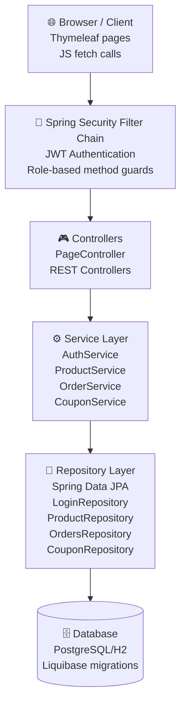
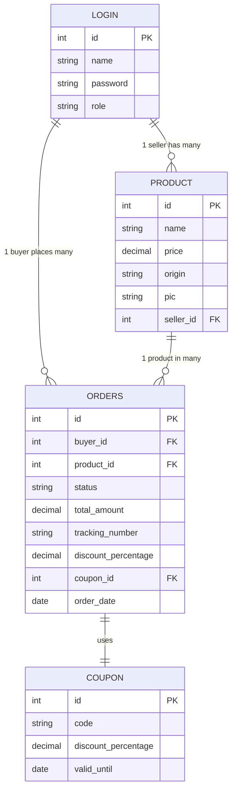

# Mini Marketplace

A Spring Boot project that provides a full-featured mini marketplace. The platform supports three roles: Admin, Seller, and Buyer, each with specific permissions and functionalities.

---

## Table of Contents

- [Project Description](#project-description)
- [Architecture](#architecture)
- [ER Diagram](#er-diagram)
- [Features](#features)
- [API Endpoints](#api-endpoints)
- [Tech Stack](#tech-stack)
- [Run Instructions](#run-instructions)
- [CI/CD Workflow](#cicd-workflow)
- [Pipeline](#pipeline)
- [Branch Strategy](#branch-strategy)
- [Render Deployment](#render-deployment)

---

## Project Description

Mini Marketplace is a web-based application that allows:

- Admins -> can manage the whole marketplace , can see all products available in the marketplace , can add coupon ( edit/delete) ,manage users
- Sellers -> can add, update, delete products and view orders.
- Buyers -> can browse products, place orders, and apply coupons.

The application is developed with Spring Boot, Java, and Maven, and uses PostgreSQL for data persistence. Additionally, it features Git-based CI/CD pipelines, Spring Security for authentication and authorization, Data Transfer Objects (DTOs) for clean data handling, and comprehensive unit and integration tests.

---

## Architecture

The project follows a standard Spring Boot layered architecture:

1. Controller Layer – Handles HTTP requests and routes them to services.
2. Service Layer – Implements business logic.
3. Repository Layer – Interacts with the database.
4. Model Layer – Represents entities and data structures.

Architecture Diagram:



---

## ER Diagram

The database structure consists of the following key entities:

- User – Represents Admin, Buyer, Seller
- Product – Added by Seller
- Order – Placed by Buyer
- Coupon – Managed by Admin



---

## Features

- User signup/login with role-based access
- Admin dashboard for managing users, products , orders, and coupons
- Seller dashboard for managing products and viewing orders
- Buyer functionality for browsing products, managing cart, placing orders, and using coupons
- Session-based cart for buyers
- Dashboard stats like total sales, top sellers, and total spent

---

## API Endpoints

| Method | Path                | Auth     | Role | Description                              |
| ------ | ------------------- | -------- | ---- | ---------------------------------------- |
| GET    | /login              | Public   | All  | Show login page                          |
| GET    | /signup             | Public   | All  | Show signup page                         |
| POST   | /signup             | Public   | All  | Register a new user (buyer or seller)    |
| GET    | /redirect-dashboard | Required | All  | Redirect user to dashboard based on role |

### Admin Endpoints

| Method | Path                | Auth     | Role  | Description                        |
| ------ | ------------------- | -------- | ----- | ---------------------------------- |
| GET    | /admin              | Required | ADMIN | Redirect to admin dashboard        |
| GET    | /admin/dashboard    | Required | ADMIN | View admin dashboard               |
| GET    | /admin/users        | Required | ADMIN | View all users                     |
| DELETE | /admin/users/{id}   | Required | ADMIN | Delete a user by ID                |
| GET    | /admin/coupons      | Required | ADMIN | View all coupons                   |
| POST   | /admin/coupons      | Required | ADMIN | Create a new coupon                |
| GET    | /admin/coupons/{id} | Required | ADMIN | View coupon details for editing    |
| PUT    | /admin/coupons/{id} | Required | ADMIN | Update coupon details              |
| DELETE | /admin/coupons/{id} | Required | ADMIN | Delete a coupon by ID              |
| GET    | /admin/sales        | Required | ADMIN | View sales summary and top sellers |

### Seller Endpoints

| Method | Path                         | Auth     | Role   | Description                         |
| ------ | ---------------------------- | -------- | ------ | ----------------------------------- |
| GET    | /seller/dashboard/{username} | Required | SELLER | View seller dashboard               |
| GET    | /seller/products/{username}  | Required | SELLER | View seller's products              |
| POST   | /seller/products             | Required | SELLER | Add a new product                   |
| PUT    | /seller/products/{id}        | Required | SELLER | Update an existing product          |
| DELETE | /seller/products/{id}        | Required | SELLER | Delete a product by ID              |
| GET    | /seller/orders/{username}    | Required | SELLER | View orders received for the seller |

### Buyer Endpoints

| Method | Path                                    | Auth     | Role  | Description                    |
| ------ | --------------------------------------- | -------- | ----- | ------------------------------ |
| GET    | /buyer/dashboard/{username}             | Required | BUYER | View buyer dashboard           |
| GET    | /buyer/products/{username}              | Required | BUYER | Browse all products            |
| GET    | /buyer/cart/{username}                  | Required | BUYER | View cart contents             |
| GET    | /buyer/add-to-cart/{id}/{username}      | Required | BUYER | Add product to cart            |
| GET    | /buyer/remove-from-cart/{id}/{username} | Required | BUYER | Remove product from cart       |
| GET    | /buyer/orders/{username}                | Required | BUYER | View buyer's order history     |
| GET    | /buyer/check-coupon?code={code}         | Required | BUYER | Validate a coupon code         |
| POST   | /buyer/checkout                         | Required | BUYER | Checkout cart and place orders |

---

## Tech Stack

| Layer            | Technology                          |
| ---------------- | ----------------------------------- |
| Language         | Java 17                             |
| Framework        | Spring Boot 3.3.4                   |
| Security         | Spring Security, JWT, BCrypt        |
| Database         | PostgreSQL (runtime), H2 (tests)    |
| ORM              | Spring Data JPA / Hibernate         |
| Migrations       | Liquibase                           |
| Views            | Thymeleaf + Spring Security Extras  |
| API Docs         | springdoc-openapi / Swagger UI      |
| Testing          | JUnit 5, Mockito, MockMvc           |
| Containerization | Docker + Docker Compose             |
| CI/CD            | GitHub Actions + Render deploy hook |

---

## Run Instructions

(Docker-based)

1.  Clone the Repository

```bash
git clone https://github.com/ShifatHasanGNS/mini-marketplace.git
cd mini-marketplace
```

2. Build the Docker Image

```bash
docker build -t mini-marketplace .
```

3. Run the Application with Docker

```bash
docker run -p 8080:8080 mini-marketplace
```

The application will start at: http://localhost:8080

---

## Render Deployment

### Prerequisites

- GitHub repository with the mini-marketplace code
- Render account (https://render.com)
- PostgreSQL database ready (Render managed or external)

### Steps

1. **Connect Your Repository to Render**
   - Go to Render dashboard → New + → Web Service
   - Connect your GitHub repository
   - Select the branch to deploy (e.g., `main`)

2. **Configure Web Service**
   - **Name**: `mini-marketplace`
   - **Environment**: Docker
   - **Dockerfile**: `Dockerfile` (default)
   - **Build Command**: `./mvnw clean package -DskipTests` (or leave empty, Docker handles it)
   - **Start Command**: Leave empty (uses ENTRYPOINT from Dockerfile)

3. **Add PostgreSQL Database**
   - In Render dashboard, create a new PostgreSQL database service
   - Note the connection details (host, port, user, password)
   - Or use an external database and save the `DATABASE_URL`

4. **Set Environment Variables**
   - Go to Web Service settings → Environment
   - Add the following variables:
     - `DATABASE_URL`: Connection string (auto-provided if using Render Postgres)
     - `JDBC_DATABASE_URL`: Same as `DATABASE_URL` or custom format
     - `JDBC_DATABASE_USERNAME`: Database user
     - `JDBC_DATABASE_PASSWORD`: Database password
     - `PORT`: `8080` (optional, Render sets this)
     - `SPRING_PROFILES_ACTIVE`: `production` (optional)

5. **Link Database to Web Service** (if using Render Postgres)
   - In Web Service environment settings, link the Postgres service
   - Render auto-injects connection details

6. **Deploy**
   - Save and return to Web Service dashboard → Manual Deploy
   - Or enable Auto-Deploy on push for CI/CD

7. **Verify**
   - Wait for build and deployment to complete
   - Visit your app URL: `https://<your-service-name>.onrender.com/login`
   - Test login, signup, and dashboard flows

### Environment Variables for Render

| Variable                 | Source                   | Required |
| ------------------------ | ------------------------ | -------- |
| `DATABASE_URL`           | Render Postgres          | Yes      |
| `JDBC_DATABASE_URL`      | Same or custom           | No       |
| `JDBC_DATABASE_USERNAME` | Render Postgres          | Yes      |
| `JDBC_DATABASE_PASSWORD` | Render Postgres          | Yes      |
| `PORT`                   | Auto (8080)              | No       |
| `SPRING_PROFILES_ACTIVE` | Optional (default: none) | No       |

### Troubleshooting

- **Connection refused**: Verify `DATABASE_URL` is set and database is running
- **Port binding error**: Ensure `PORT` env var is set (Render provides it automatically)
- **Build fails**: Check logs → mvn clean package command and Dockerfile
- **App starts but no connection**: Ensure Postgres service is linked or DATABASE_URL is correct
